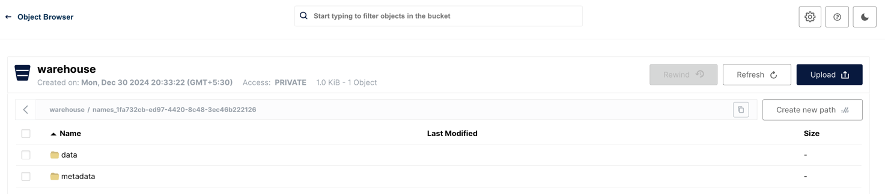

### What is a Data Lakehouse? <br>
A Data Lakehouse combines the best of both data lakes and data warehouses. <br>
It provides data lakes' raw storage capabilities and data warehouses' structured querying capabilities. <br>
This hybrid model ensures flexibility in storing vast amounts of unstructured data, while also enabling SQL-based structured queries, ensuring that businesses can derive meaningful insights from their data.


We will be implementing a basic lakehouse locally on your laptop with the following components:
- Apache Spark, which can be used for ingesting streaming or batch data into our lakehouse
- Minio to act as our data lake repository and be the s3 compatible storage layer.
- Apache Iceberg, as our table format, allows query engines to plan smarter, faster queries on our data lakehouse data.
- Nessie is our data catalog allowing our datasets to be discoverable and accessible across our tools. Nessie also provides git-like features for data quality, experimentation and disaster recovery. (Get even more features like an intuitive UI and automated table optimization when you use Dremio Arctic cloud managed Nessie based catalog.)
- Dremio will be our query engine which we can use performantly query our data but also document, organize and deliver our data to our consumers, such as data analysts doing ad-hoc analytics or building out BI dashboards.

### Create a Docker Compose File and Running it
Building a Data Lakehouse on your local machine requires orchestrating multiple services, and Docker Compose is a perfect tool for this task. <br>
This section will create a docker-compose.yml file to define and run multi-container Docker applications for our Data Lakehouse environment.

Steps:
1. Install Docker: Ensure that you have Docker installed on your laptop. If not, you can download it from the official Docker website.
2. Create Docker Compose File:
3. Navigate to a directory where you want to create your project. Here, create a file named docker-compose.yml. Populate this file with the following content:

```
version: "3.9"

services:
  dremio:
    platform: linux/x86_64
    image: dremio/dremio-oss:latest
    ports:
      - 9047:9047
      - 31010:31010
      - 32010:32010
    container_name: dremio

  minioserver:
    image: minio/minio
    ports:
      - 9000:9000
      - 9001:9001
    environment:
      MINIO_ROOT_USER: minioadmin
      MINIO_ROOT_PASSWORD: minioadmin
    container_name: minio
    command: server /data --console-address ":9001"

  spark_notebook:
    image: alexmerced/spark33-notebook
    ports: 
      - 8888:8888
    env_file: .env
    container_name: notebook
  
  nessie:
    image: projectnessie/nessie
    container_name: nessie
    ports:
      - "19120:19120"

networks:
  default:
    name: iceberg_env
    driver: bridge  
```

### Create Environment File:
Alongside your docker-compose.yml file, create an .env file to manage your environment variables.<br>
Start with the given template and fill in the details as you progress.
``` 
# Fill in Details

# AWS_REGION is used by Spark
AWS_REGION=us-east-1

# This must match if using minio
MINIO_REGION=us-east-1

# Used by pyIceberg
AWS_DEFAULT_REGION=us-east-1

# AWS Credentials (this can use minio credential, to be filled in later)
AWS_ACCESS_KEY_ID=XXXXXXXXXXXXXXX
AWS_SECRET_ACCESS_KEY=xxxxxxx

# If using Minio, this should be the API address of Minio Server
AWS_S3_ENDPOINT=http://minioserver:9000

# Location where files will be written when creating new tables
WAREHOUSE=s3a://warehouse/

# URI of Nessie Catalog
NESSIE_URI=http://nessie:19120/api/v1
```

### Run the Docker Compose:

Open four terminals for clearer log visualization. <br>
Each service should have its terminal. <br>
Ensure you are in the directory containing the docker-compose.yml file, and then run:

In the first terminal: <br>
``` 
docker-compose up minioserver 
```
Headover, to localhost:9001 in your browser and login with credentials (user : minioadmin, password : minioadmin).<br> 
Once your logged in do the following:<br>
- create a bucket called "warehouse"<br>
- create an access key and copy the access key and secret key to your .env file<br>


In the second terminal: <br>
``` 
docker-compose up nessie 
```

In the logs when this container open look for output the looks like the following and copy and paste the URL into your browser. <br>
``` 
notebook  |  or http://127.0.0.1:8888/?token=9db2c8a4459b4aae3132dfabdf9bf4396393c608816743a9
```
<br>
<br>

In the third terminal: <br>

``` 
docker-compose up spark_notebook 
```

In the fourth terminal: <br>
``` 
docker-compose up dremio 
```

After completing these steps, you will have Dremio, Minio, and a Spark Notebook running in separate Docker containers on your laptop, ready for further Data Lakehouse operations!

### Creating a Table in Spark
From the jupyter notebook window you opened in the browser earlier, create a new notebook with the following code.

``` 
import pyspark
from pyspark.sql import SparkSession
import os


## DEFINE SENSITIVE VARIABLES
NESSIE_URI = os.environ.get("NESSIE_URI") ## Nessie Server URI
WAREHOUSE = os.environ.get("WAREHOUSE") ## BUCKET TO WRITE DATA TOO
AWS_ACCESS_KEY = os.environ.get("AWS_ACCESS_KEY_ID") ## AWS CREDENTIALS
AWS_SECRET_KEY = os.environ.get("AWS_SECRET_ACCESS_KEY") ## AWS CREDENTIALS
AWS_S3_ENDPOINT= os.environ.get("AWS_S3_ENDPOINT") ## MINIO ENDPOINT


print(AWS_S3_ENDPOINT)
print(NESSIE_URI)
print(WAREHOUSE)


conf = (
    pyspark.SparkConf()
        .setAppName('app_name')
        .set('spark.jars.packages', 'org.apache.iceberg:iceberg-spark-runtime-3.3_2.12:1.3.1,org.projectnessie.nessie-integrations:nessie-spark-extensions-3.3_2.12:0.67.0,software.amazon.awssdk:bundle:2.17.178,software.amazon.awssdk:url-connection-client:2.17.178')
        .set('spark.sql.extensions', 'org.apache.iceberg.spark.extensions.IcebergSparkSessionExtensions,org.projectnessie.spark.extensions.NessieSparkSessionExtensions')
        .set('spark.sql.catalog.nessie', 'org.apache.iceberg.spark.SparkCatalog')
        .set('spark.sql.catalog.nessie.uri', NESSIE_URI)
        .set('spark.sql.catalog.nessie.ref', 'main')
        .set('spark.sql.catalog.nessie.authentication.type', 'NONE')
        .set('spark.sql.catalog.nessie.catalog-impl', 'org.apache.iceberg.nessie.NessieCatalog')
        .set('spark.sql.catalog.nessie.s3.endpoint', AWS_S3_ENDPOINT)
        .set('spark.sql.catalog.nessie.warehouse', WAREHOUSE)
        .set('spark.sql.catalog.nessie.io-impl', 'org.apache.iceberg.aws.s3.S3FileIO')
        .set('spark.hadoop.fs.s3a.access.key', AWS_ACCESS_KEY)
        .set('spark.hadoop.fs.s3a.secret.key', AWS_SECRET_KEY)
)


## Start Spark Session
spark = SparkSession.builder.config(conf=conf).getOrCreate()
print("Spark Running")


## Create a Table
spark.sql("CREATE TABLE nessie.names (name STRING) USING iceberg;").show()


## Insert Some Data
spark.sql("INSERT INTO nessie.names VALUES ('Alex Merced'), ('Dipankar Mazumdar'), ('Jason Hughes')").show()


## Query the Data
spark.sql("SELECT * FROM nessie.names;").show()
```

Run the code, creating a table you can confirm by opening up the minio dashboard.




source : https://www.linkedin.com/pulse/creating-local-data-lakehouse-using-alex-merced/